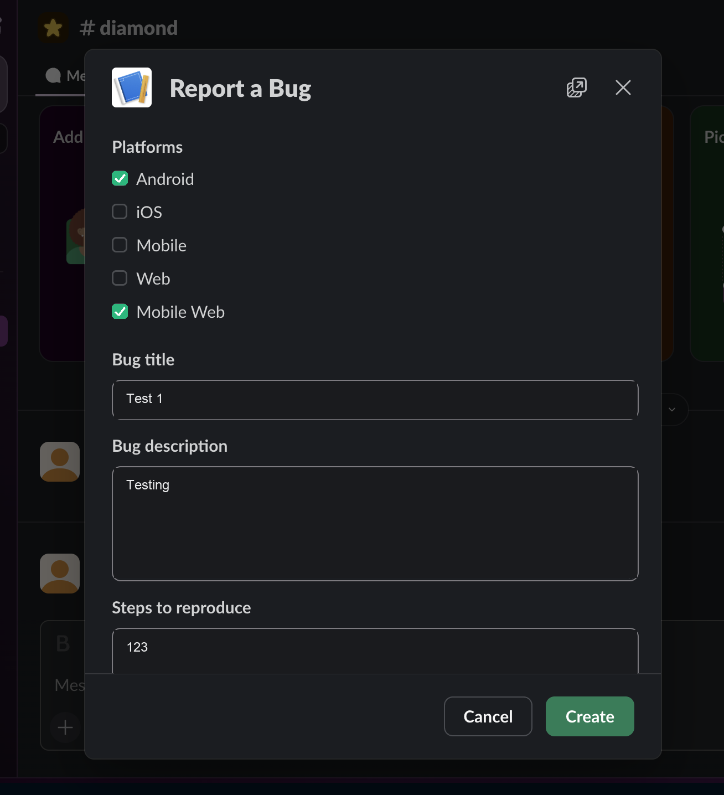
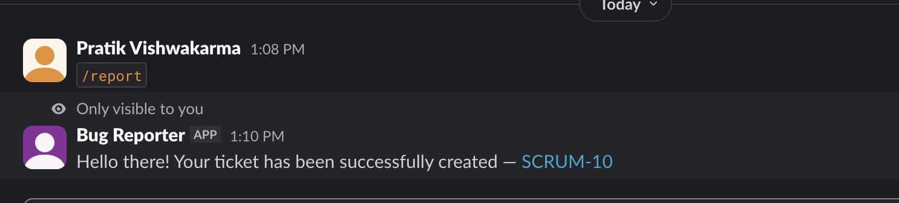
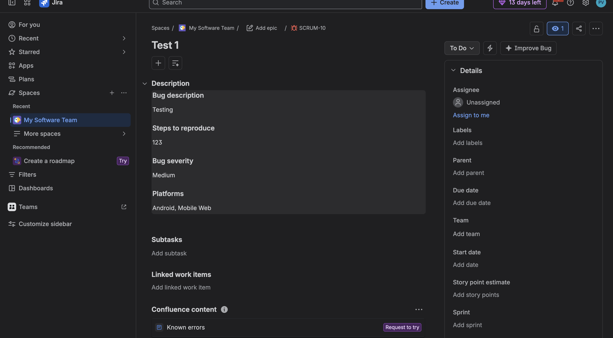

# Slack → Jira Bug Reporter

A Slack `/report` command that opens a structured bug-report form and files it straight into Jira — no copy-pasting, no context-switching.

## Why I built this

Bug reports were coming in as free-text Slack messages: inconsistent detail, missing repro steps, no severity, and someone had to manually re-type them into Jira as a separate step. That's slow and error-prone, and reports would sit in a channel until someone got around to filing them.

## The problem it solves

- **No structure** → reports missing platform, steps to reproduce, or severity
- **Manual double-entry** → someone copies the Slack message into Jira by hand
- **Lost context** → the Jira ticket and the original Slack conversation aren't linked
- **Slow turnaround** → reporting a bug meant leaving Slack, opening Jira, and filling in a form there

This tool collapses that into one step: type `/report`, fill in a short form, click Create — a Jira Bug exists and you get the ticket link back, all without leaving Slack.

## How it works

1. Type `/report` in **#diamond**
2. A modal opens:
   - **Platforms** — multi-select checkboxes (Android, iOS, Mobile, Web, Mobile Web)
   - **Bug title**
   - **Bug description**
   - **Steps to reproduce**
   - **Bug severity** — dropdown (Critical, High, Medium, Low)
3. **Cancel** closes the modal, nothing happens.
4. **Create** files a Jira **Bug** (title → summary, the rest → description) and replies privately in #diamond:
   > Hello there! Your ticket has been successfully created — **SCRUM-42**
   with a link straight to the ticket. A Jira/network failure surfaces as a private error message instead of failing silently.

## Demo

**1. `/report` in #diamond opens the modal** — pick platforms, fill in the title, description, and steps to reproduce.



**2. Click Create → a private confirmation appears with the ticket link**



**3. The Jira issue is created with everything mapped into the description**



## Architecture

```
Slack (#diamond)  <--WebSocket, Socket Mode-->  Node.js app  --REST API-->  Jira Cloud
```

- **`app.js`** — Slack side: registers `/report`, restricts it to #diamond, builds and opens the modal, handles the submission, posts the confirmation.
- **`jira.js`** — Jira side: turns the submitted fields into a Jira issue payload (Atlassian Document Format for the description) and calls `POST /rest/api/3/issue`.
- **`slack-app-manifest.yml`** — the entire Slack app configuration (command, bot scopes, Socket Mode) as one reproducible file.

**Why Socket Mode:** the app opens an outbound connection to Slack instead of needing a public HTTPS server. No hosting, no tunnel, no deployment for this to work — run it locally with `npm start`.

## Tech stack

- Node.js + [Slack Bolt](https://slack.dev/bolt-js) — Slack's official SDK
- Jira Cloud REST API v3 (plain `fetch`, no SDK)
- Config/secrets via `.env` (git-ignored)

## Setup

1. **Create a Slack app** at https://api.slack.com/apps → **From a manifest** → paste [`slack-app-manifest.yml`](slack-app-manifest.yml).
2. **Basic Information → App-Level Tokens** → generate one with scope `connections:write` → `SLACK_APP_TOKEN`.
3. **Install App → Install to Workspace** → copy the Bot Token → `SLACK_BOT_TOKEN`.
4. **Basic Information → Signing Secret** → `SLACK_SIGNING_SECRET`.
5. Invite the bot to **#diamond**, then copy its channel ID (channel name → bottom of the popup) → `DIAMOND_CHANNEL_ID`.
6. **Jira**: create an API token at https://id.atlassian.com/manage-profile/security/api-tokens.
   Set `JIRA_BASE_URL`, `JIRA_EMAIL`, `JIRA_API_TOKEN`, `JIRA_PROJECT_KEY` (and confirm that project has a **Bug** issue type).

```bash
cp .env.example .env   # fill in the values above
npm install
npm start
```

## Limitations / possible next steps

- Runs locally via Socket Mode — for a shared/always-on deployment, switch to HTTP mode and host it.
- Severity and platforms are written into the Jira description as text rather than mapped to native fields (priority, labels) — straightforward to add if the target project has them.
- No retry/queue if the Jira call fails; the user just gets an error and can resubmit.
- No automated tests yet.
